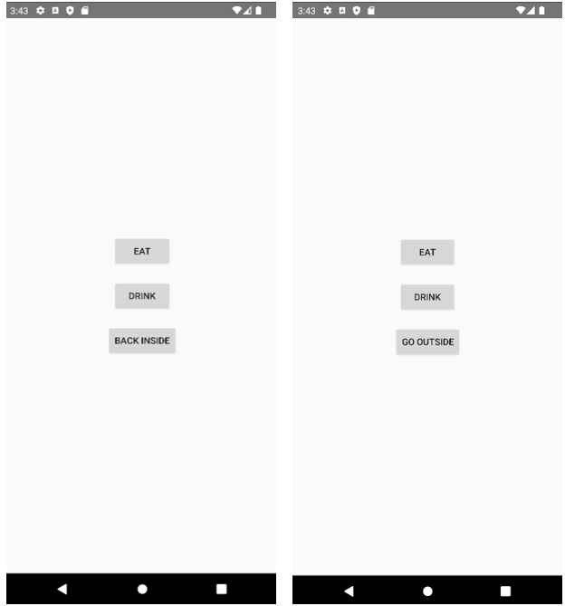
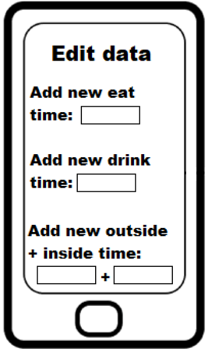
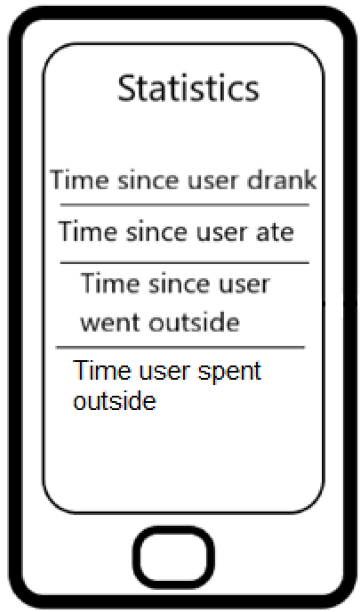

# Food-Stuff Logs

My idea for this project is to make an application which people can use to improve their health and wellbeing. My initial ideais the following:
An application that tracks the time since you last ate something, drank something and the last time you went outside. I also want this application to track the amount of time you spend outside that day.

Here are some ways I thought of to make use of AI regarding this idea:

---

1. Smart Reminders & Predictions
Instead of just reminding the user after a fixed time, an AI model could:  
 - Learn personal habits (e.g., you usually drink every 3 hours).  
 - Predict when the user is likely to forget to eat, drink, or go outside.  
 - Suggest reminders at the right time (not too early, not too late).  
 - Example: If the model sees you skipped meals yesterday at lunchtime, it might proactively nudge you earlier today.

---

2. Chatbot Coach
A conversational AI could:
- Let users log events by typing or speaking naturally (If a user types “I just had a sandwich” would be logged as eating).
- Answer questions like:
  - “How long since I last drank water?”
  - “How much time have I spent outside this week?”
- Offer encouragement or tips when it detects unhealthy habits.

---

3. Pattern Recognition & Insights
An AI system could analyze logs over time to provide personalized insights:
- “You usually go outside more on weekends than weekdays.”
- “You tend to drink less water on days you stay indoors.”
- “You average 25 minutes outside per day; increasing it to 45 minutes could improve your mood and energy.”  
- This can be rule-based at first, but AI can make correlations (e.g., weather vs. your outdoor time).  

---

After some work I have set up a small android application with a simple UI.   This UI consists of 3 simple buttons that can be pressed, one for eating, one for drinking and the last for going outside/back inside.   

I have also designed some new pages I want to add to my application which consist of the Satistics and the EditData page.  

The EditData page should allow the user to add moments when they ate, drink or went outside at the end of the day incase they forgot:

 

The Statistics page should hold the general data of the user like the following:
- When the last time was since the user ate/drank/went outside
- How long the user has been outside today
- How often a user has eaten/drank something today
- etc.

 

Now I am working on getting the buttons to work. I need to find a way to save the time and date whenever a user presses one of the three buttons and send that data to a place where it can be stored and read by the AI.

I have made a small dataset with the following activities: 
  user_id,activity,timestamp 
Next I have made a simple converter file using python which converts the data from the dataset into features which the AI model can use to train. These are the features I am using to train the model:  
user_id,activity,timestamp,hour,day_of_week,is_weekend,minutes_since_midnight,time_since_last_drink,time_since_last_eat,time_since_last_outside,avg_drink_gap,avg_eat_gap,minutes_until_next  

I have also made a simple python file which is used for training the AI model.

The last week I have worked on making the "eat", "drink" and "go outside" buttons work. Now if the user clicks any of these buttons the date and time of the action is stored locally to the phone. This is helpful because it allows me to take that locally stored data, import it to my laptop and train my AI with it. This is done manually for now because this will be used to expand my dataset to train the initial AI. Later the AI will use this locally stored data to make predictions, give feedback, etc.

Now I am working on training the model I have chosen and understanding the basics of working with making my own AI. I decided to use a more basic scikit-learn model to begin with, and change the model later if necessary. After running the model for the fist time the results were very precise and good, a little too good for a first run. I think I did something wrong while setting up the AI or testing it so I will have to check what the problem is. After being able to test the AI I am going to work on implementing the AI into the android application.

After a couple days of work I redefined my AI goals and added niet parts to my implementation. Instead of predicting WHEN a user is going to eat/drink/go outside the next day I am going to predict HOW OFTEN a user will eat/drink the following day. After making new python nodes and writing new code I managed to train two new models. These models use the same dataset, but different features so I had to make a new converter file too. After generating a larger dataset and feeding it to the AI I made two nodes to test the performance of my AIs. The output of these tests can be seen in the images below.

